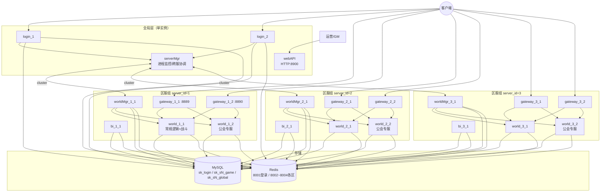

# garden 项目框架总结

## 1. 框架概括

**mirage_skynet** 是基于 [Skynet](https://github.com/cloudwu/skynet) 的 **MMORPG 分布式游戏服务端**，Lua 编写业务逻辑，sproto 做客户端协议，MySQL + Redis 持久化，skynet.cluster 做跨进程通信。

### 进程类型（7 种，共 22 个 OS 进程）

| 类型 | 实例数 | 命名规则 | 主要职责 |
|------|--------|----------|----------|
| **serverMgr** | 1 | `serverMgr` | 全局协调中心：进程状态监控、login/worldMgr 同步、跨服角色数据中转 |
| **login** | 2 | `login_{proc_id}` | 账号注册/登录、Token、服务器列表；TCP 8888 |
| **webAPI** | 1 | `webAPI` | 对外 HTTP 接口（踢人、GM 通知等）；HTTP 8900 |
| **gateway** | 6 | `gateway_{server_id}_{proc_id}` | 客户端长连接入口，协议转发到 world；TCP 8889+ |
| **worldMgr** | 3 | `worldMgr_{server_id}_1` | 区服级全局数据、角色在线路由、跨 world 数据查询、缓存淘汰 |
| **bi** | 3 | `bi_{server_id}_1` | 异步 BI 日志采集与落盘 |
| **world** | 6 | `world_{server_id}_{proc_id}` | 游戏核心逻辑；proc_id=1 为常规逻辑服，proc_id=2 为公会专服 |

**区服组（server_id）**：3 组（1/2/3），每组 2 gateway + 1 worldMgr + 1 bi + 2 world。

### 客户端链路

```
Client → login(8888) 账号认证/选服
       → gateway(8889+) join_game
       → world(world_agent) 游戏逻辑
       → gateway 回包给客户端
```

world 内按玩家创建 `world_agent`，模块化加载 player/bag/task/partner/guild/friend/mail/fight 等。

### 架构图（依据 start.sh 启动顺序）



**start.sh 启动顺序**（每进程间隔 2s）：

```
serverMgr → login_1/2 → webAPI → [每组: gateway×2 → worldMgr → bi → world×2]×3
```

具体进程列表：

```
serverMgr
login_1, login_2
webAPI
gateway_1_1, gateway_1_2, worldMgr_1_1, bi_1_1, world_1_1, world_1_2
gateway_2_1, gateway_2_2, worldMgr_2_1, bi_2_1, world_2_1, world_2_2
gateway_3_1, gateway_3_2, worldMgr_3_1, bi_3_1, world_3_1, world_3_2
```

**独立进程**：`console`（`run_console.sh`）为调试客户端，模拟登录/进服/发协议，不在 start.sh 中。

### 拓扑与配置

进程拓扑由 `etc/topology.yaml` 作为单一数据源，通过 `tools/gen_config.lua` 生成 `config.*`、`clustername.*`、`start.sh`、`stop.sh`、`kill.sh`。
使用举例:
lua tools/gen_config.lua          # 生成 config.* / clustername.* / start.sh
lua tools/gen_config.lua --check  # 端口冲突检测
lua tools/gen_config.lua --dump-ports  # 端口一览

命名规则：`{type}_{server_id}_{proc_id}`

- `type`：进程类型
- `server_id`：服务器组编号（1/2/3）
- `proc_id`：组内进程编号

---

## 2. 目录模块划分

| 目录 | 功能 |
|------|------|
| **skynet/** | Skynet 引擎源码与运行时（C + lualib） |
| **common/** | 公共基础设施：logger、mysqlpool、redispool、config_mgr、protoloader、data_access、data_sync、proc_state、graceful_stop、bi_log 等 |
| **login/** | 登录进程：`login_main` 入口；account_service、server_list、login_watchdog/agent |
| **gateway/** | 网关进程：TCP 接入、join_game、协议转发到 world |
| **world/** | 游戏逻辑进程：`world_agent` + agent 子模块（player/bag/task/partner/guild/friend/mail/fight）；standalone 服（fighting_mgr/fighting、guild_manager/guild）；timer_service |
| **worldMgr/** | 区服管理进程：global_data、role_data_transmit_mgr（跨 world/跨服查角色）、handle_message |
| **serverMgr/** | 全局管理：proc_state_service、跨服 relay、login/worldMgr 状态同步 |
| **bi/** | BI 日志：bi_push/bi_consumer、server_map、handlers（file_log/server_traceback） |
| **webAPI/** | HTTP 对外接口：http_watchdog/agent、router、module（player/guild/system） |
| **console/** | 本地调试控制台，模拟客户端协议交互 |
| **sproto/** | 客户端协议定义 c2s.sproto / s2c.sproto |
| **config/** | 游戏策划配置表（cfg_item/skill/task/partner 等 Lua 表） |
| **etc/** | 进程配置：`topology.yaml`（拓扑单一数据源）、`config.*`、`clustername.*` |
| **data/** | SQL 建表脚本：login/game/global/merge_server/migrate_shard |
| **tools/** | 运维工具：合服脚本 merge_server.py、redis_ctl.py |
| **log/** | 各进程运行日志与 pid（运行时生成） |

### world 内部模块结构

```
world/service/
├── world_agent.lua      # 玩家会话主服务，模块生命周期管理
├── handle_message.lua   # 集群消息入口（client_request/agent_cmd）
├── timer_service.lua    # Redis ZSET 持久化定时器
├── agent/               # 玩家逻辑模块（按玩家加载）
│   ├── player.lua
│   ├── bag.lua
│   ├── task.lua
│   ├── partner.lua
│   ├── guild.lua
│   ├── friend.lua
│   ├── mail.lua
│   └── fight.lua
└── standalone/          # 区服级独立服务（非 per-player）
    ├── fighting_mgr.lua + fighting.lua   # 战斗（world proc_id=1 常规服）
    └── guild_manager.lua + guild.lua     # 公会（world proc_id=2 专服，WORLD_FUNC_FLAG=guild）
```

### 各进程入口与核心服务

| 进程 | 入口文件 | 核心服务 |
|------|----------|----------|
| serverMgr | `serverMgr/serverMgr_main.lua` | handle_message、proc_state_service、mysqlpool(login) |
| login | `login/login_main.lua` | account_service、server_list、login_watchdog、protoloader |
| gateway | `gateway/gateway_main.lua` | gateway_watchdog、gateway_agent、protoloader |
| world | `world/world_main.lua` | handle_message、timer_service、fighting_mgr 或 guild_manager |
| worldMgr | `worldMgr/worldMgr_main.lua` | global_data、role_data_transmit_mgr、data_sync、cache_evict |
| bi | `bi/bi_main.lua` | bi_push、bi_consumer、server_map |
| webAPI | `webAPI/webAPI_main.lua` | http_watchdog、http_agent、module router |

### 存储划分

| 数据库 | 用途 | 使用者 |
|--------|------|--------|
| sk_login | 账号、登录相关 | login、serverMgr、bi |
| sk_s{N}_game | 玩家游戏数据 | world、worldMgr |
| sk_s{N}_global | 区服全局数据 | world、worldMgr |
| Redis 8001 | 登录服缓存 | login |
| Redis 8002~8004 | 各区服缓存 | 对应 server_id 的 world/worldMgr/bi |
