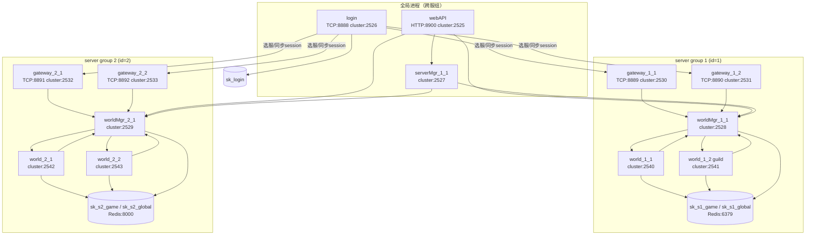
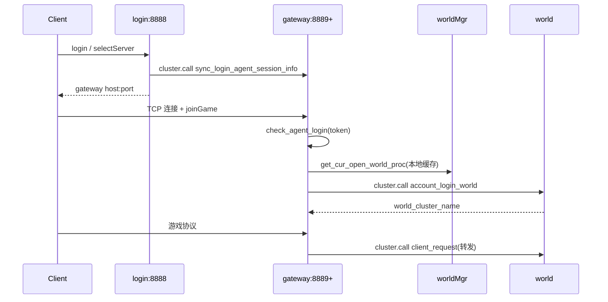

## 启动顺序（`start.sh` = `topology.yaml` startup_order）

```
serverMgr_1_1 → login → webAPI
→ [服1] gateway_1_1/1_2 → worldMgr_1_1 → world_1_1/1_2
→ [服2] gateway_2_1/2_2 → worldMgr_2_1 → world_2_1/2_2
```

共 **13 个 Skynet OS 进程**，命名规则 `{type}_{server_id}_{proc_id}`。

---

## 进程拓扑（按 server group 分组）



---

## 运行时调用关系

### 1. 客户端进游戏链路



### 2. 负载与调度

| 方向 | 调用 | 作用 |
|------|------|------|
| gateway → login | `sync_gateway_port` | 上报 TCP 端口与在线数，供选服负载均衡 |
| world → worldMgr | `sync_world_loading` | 上报在线人数/过载状态 |
| worldMgr → gateway | `sync_cur_open_world_proc` | 广播当前最优 world 进程 |
| worldMgr → world | `notify_world_0am/6am_update` | 定时广播 |
| worldMgr → guild_manager | 同上 | 公会专用 world 进程 |

### 3. 运维链路（webAPI）

```
HTTP → webAPI.handle_message
  ├─ call_servermgr → serverMgr_1_1
  ├─ call_worldmgr  → worldMgr_{server_id}_1
  └─ call_world     → world_{server_id}_{proc_id}
```

---

## 进程职责速查

| 进程 | 数量 | 对外端口 | 职责 |
|------|------|----------|------|
| serverMgr | 1 | cluster 2527 | 全局配置 |
| login | 1 | TCP 8888 | 账号、选服、分配 gateway |
| webAPI | 1 | HTTP 8900 | GM/运营接口 |
| gateway | 每组 N 个 | TCP 8889+ | 客户端长连接、协议转发 |
| worldMgr | 每组 1 个 | 无 TCP | 负载调度、全服定时、分表/缓存 |
| world | 每组 M 个 | 无 TCP | 玩家逻辑 agent；proc_id=2 跑 guild |

当前配置：2 组 × (2 gateway + 2 world)，组 1 的 `world_1_2` 设 `WORLD_FUNC_FLAG=guild`。

---

## cluster 可见性（`clustername.*`）

- **login**：可见全部 gateway + worldMgr + serverMgr
- **gateway**：仅见本组 world + worldMgr + login
- **world**：仅见本组 gateway + worldMgr
- **worldMgr**：见本组 gateway/world + login + serverMgr
- **webAPI**：可见全部节点（最全）
- **serverMgr**：见 login + 全部 worldMgr

进程间通信用 Skynet `cluster.call/send`，统一入口为各进程的 `.handle_message` 服务。
